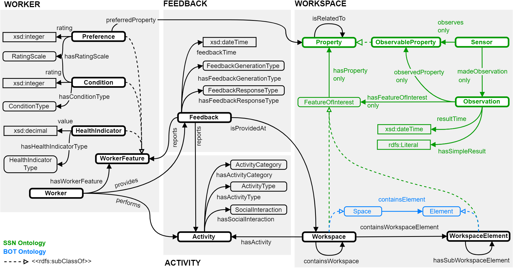

Markdown documentation created by [pyLODE](http://github.com/rdflib/pyLODE) 2.4

# The Occupant-centric Workplace Management ontology (WOMO)

## Metadata

- **IRI**
  - `https://w3id.org/womo#`
- **Creators(s)**
  - [Alessandro Bruttini](https://orcid.org/0000-0001-6317-2406)
    [[ORCID]](https://orcid.org/0000-0001-6317-2406)
    (<alessandro.bruttini@unifi.it></a>) of [University of Florence, IT](https://www.linkedin.com/in/alessandro-bruttini-2228883b/)
- **Created**
  - 2023-07-19
- **Version Information**
  - 1.0
- **License**
  - CC-BY-40
- **Ontology RDF**
  - RDF ([.\womo.ttl](turtle))

### Description

The Occupant-centric Workplace Management (WOMO) ontology describes knowledge related to office environments and enables the development of a workplace Digital Twin system centred on the occupant experience.

## Table of Contents

1. [Classes](#classes)
1. [Object Properties](#objectproperties)
1. [Datatype Properties](#datatypeproperties)
1. [Named Individuals](#namedindividuals)
1. [Namespaces](#namespaces)
1. [Legend](#legend)

## Overview

.
**Figure 1:** WOMO Ontology overview

## Classes

[Activity](#Activity),
[ActivityCategory](#ActivityCategory),
[ActivityType](#ActivityType),
[CommonSpace](#CommonSpace),
[Condition](#Condition),
[ConditionType](#ConditionType),
[Department](#Department),
[EnclosedOffice](#EnclosedOffice),
[Feedback](#Feedback),
[FeedbackGenerationType](#FeedbackGenerationType),
[FeedbackResponseType](#FeedbackResponseType),
[HealthIndicator](#HealthIndicator),
[HealthIndicatorType](#HealthIndicatorType),
[MechanicalVentilationControlType](#MechanicalVentilationControlType),
[Member](#Member),
[NaturalVentilationControlType](#NaturalVentilationControlType),
[NotRespondedFeedback](#NotRespondedFeedback),
[Office](#Office),
[Organization](#Organization),
[Preference](#Preference),
[RatingScale](#RatingScale),
[RespondedFeedback](#RespondedFeedback),
[Room](#Room),
[SocialInteraction](#SocialInteraction),
[VentilationType](#VentilationType),
[Worker](#Worker),
[WorkerFeature](#WorkerFeature),
[Workspace](#Workspace),
[WorkspaceElement](#WorkspaceElement),
[WorkspaceType](#WorkspaceType),
[Workstation](#Workstation),

### Activity

| Property      | Value                                                                                                                                                                                                                                                                                                                                                                              |
| ------------- | ---------------------------------------------------------------------------------------------------------------------------------------------------------------------------------------------------------------------------------------------------------------------------------------------------------------------------------------------------------------------------------- |
| IRI           | `https://w3id.org/womo#Activity`                                                                                                                                                                                                                                                                                                                                                   |
| Description   | 
Thing that the worker is doing.
                                                                                                                                                                                                                                                                                                                                             |
| Super-classes | [owl:Thing](http://www.w3.org/2002/07/owl#Thing) (c)                                                                                                                                                                                                                                                                                                                          |
| In domain of  | [womo:hasActivityCategory](https://w3id.org/womo#hasActivityCategory) (op) [womo:hasSocialInteraction](https://w3id.org/womo#hasSocialInteraction) (op) [womo:isPerformedBy](https://w3id.org/womo#isPerformedBy) (op) [womo:hasActivityType](https://w3id.org/womo#hasActivityType) (op) [womo:isPerformedAt](https://w3id.org/womo#isPerformedAt) (op)  |
| In range of   | [womo:isActivityCategoryOf](https://w3id.org/womo#isActivityCategoryOf) (op) [womo:performs](https://w3id.org/womo#performs) (op) [womo:isActivityTypeOf](https://w3id.org/womo#isActivityTypeOf) (op) [womo:hasActivity](https://w3id.org/womo#hasActivity) (op) [womo:isSocialInteractionOf](https://w3id.org/womo#isSocialInteractionOf) (op)          |

### ActivityCategory

| Property      | Value                                                                              |
| ------------- | ---------------------------------------------------------------------------------- |
| IRI           | `https://w3id.org/womo#ActivityCategory`                                           |
| Description   | 
Specifies the category of the activity that the worker is performing.
       |
| Super-classes | [owl:Thing](http://www.w3.org/2002/07/owl#Thing) (c)                          |
| In domain of  | [womo:isActivityCategoryOf](https://w3id.org/womo#isActivityCategoryOf) (op)  |
| In range of   | [womo:hasActivityCategory](https://w3id.org/womo#hasActivityCategory) (op)    |

### ActivityType

| Property      | Value                                                                                                                                                                  |
| ------------- | ---------------------------------------------------------------------------------------------------------------------------------------------------------------------- |
| IRI           | `https://w3id.org/womo#ActivityType`                                                                                                                                   |
| Description   | 
Specifies the type of activity that the worker is performing.
                                                                                                   |
| Super-classes | [owl:Thing](http://www.w3.org/2002/07/owl#Thing) (c)                                                                                                              |
| In domain of  | [womo:isActivityTypeSupportedBy](https://w3id.org/womo#isActivityTypeSupportedBy) (op) [womo:isActivityTypeOf](https://w3id.org/womo#isActivityTypeOf) (op)  |
| In range of   | [womo:hasActivityType](https://w3id.org/womo#hasActivityType) (op) [womo:supportsActivityType](https://w3id.org/womo#supportsActivityType) (op)              |

### CommonSpace

| Property      | Value                                                               |
| ------------- | ------------------------------------------------------------------- |
| IRI           | `https://w3id.org/womo#CommonSpace`                                 |
| Super-classes | [womo:WorkspaceType](https://w3id.org/womo#WorkspaceType) (c)  |

### Condition

| Property      | Value                                                                        |
| ------------- | ---------------------------------------------------------------------------- |
| IRI           | `https://w3id.org/womo#Condition`                                            |
| Super-classes | [womo:WorkerFeature](https://w3id.org/womo#WorkerFeature) (c)           |
| In domain of  | [womo:hasConditionType](https://w3id.org/womo#hasConditionType) (op)    |
| In range of   | [womo:isConditionTypeOf](https://w3id.org/womo#isConditionTypeOf) (op)  |

### ConditionType

| Property      | Value                                                                        |
| ------------- | ---------------------------------------------------------------------------- |
| IRI           | `https://w3id.org/womo#ConditionType`                                        |
| Super-classes | [owl:Thing](http://www.w3.org/2002/07/owl#Thing) (c)                    |
| In domain of  | [womo:isConditionTypeOf](https://w3id.org/womo#isConditionTypeOf) (op)  |
| In range of   | [womo:hasConditionType](https://w3id.org/womo#hasConditionType) (op)    |

### Department

| Property      | Value                                                             |
| ------------- | ----------------------------------------------------------------- |
| IRI           | `https://w3id.org/womo#Department`                                |
| Super-classes | [womo:Organization](https://w3id.org/womo#Organization) (c)  |

### EnclosedOffice

| Property      | Value                                                 |
| ------------- | ----------------------------------------------------- |
| IRI           | `https://w3id.org/womo#EnclosedOffice`                |
| Super-classes | [womo:Office](https://w3id.org/womo#Office) (c)  |

### Feedback

| Property      | Value                                                                                                                                                                                                                                                                                                                                                                                                                                                                                                                                                                                                                                                                                                                                                        |
| ------------- | ------------------------------------------------------------------------------------------------------------------------------------------------------------------------------------------------------------------------------------------------------------------------------------------------------------------------------------------------------------------------------------------------------------------------------------------------------------------------------------------------------------------------------------------------------------------------------------------------------------------------------------------------------------------------------------------------------------------------------------------------------------ |
| IRI           | `https://w3id.org/womo#Feedback`                                                                                                                                                                                                                                                                                                                                                                                                                                                                                                                                                                                                                                                                                                                             |
| Super-classes | [owl:Thing](http://www.w3.org/2002/07/owl#Thing) (c)                                                                                                                                                                                                                                                                                                                                                                                                                                                                                                                                                                                                                                                                                                    |
| In domain of  | [womo:hasFeedbackGenerationType](https://w3id.org/womo#hasFeedbackGenerationType) (op) [womo:feedbackTime](https://w3id.org/womo#feedbackTime) (dp) [womo:hasFeedbackResponseType](https://w3id.org/womo#hasFeedbackResponseType) (op) [womo:feedbackRequestTime](https://w3id.org/womo#feedbackRequestTime) (dp) [womo:isProvidedAt](https://w3id.org/womo#isProvidedAt) (op) [womo:feedbackStartTime](https://w3id.org/womo#feedbackStartTime) (dp) [womo:responseDuration](https://w3id.org/womo#responseDuration) (dp) [womo:isProvidedBy](https://w3id.org/womo#isProvidedBy) (op) [womo:reports](https://w3id.org/womo#reports) (op) [womo:responseRatio](https://w3id.org/womo#responseRatio) (dp)  |
| In range of   | [womo:isReportedBy](https://w3id.org/womo#isReportedBy) (op) [womo:isFeedbackResponseTypeOf](https://w3id.org/womo#isFeedbackResponseTypeOf) (op) [womo:provides](https://w3id.org/womo#provides) (op) [womo:hasFeedback](https://w3id.org/womo#hasFeedback) (op) [womo:isFeedbackGenerationTypeOf](https://w3id.org/womo#isFeedbackGenerationTypeOf) (op)                                                                                                                                                                                                                                                                                                                                                                          |

### FeedbackGenerationType

| Property      | Value                                                                                          |
| ------------- | ---------------------------------------------------------------------------------------------- |
| IRI           | `https://w3id.org/womo#FeedbackGenerationType`                                                 |
| Description   | 
Instances of this class enumerates possible feedback request generation types.
          |
| Super-classes | [owl:Thing](http://www.w3.org/2002/07/owl#Thing) (c)                                      |
| In domain of  | [womo:isFeedbackGenerationTypeOf](https://w3id.org/womo#isFeedbackGenerationTypeOf) (op)  |
| In range of   | [womo:hasFeedbackGenerationType](https://w3id.org/womo#hasFeedbackGenerationType) (op)    |

### FeedbackResponseType

| Property      | Value                                                                                                                                                        |
| ------------- | ------------------------------------------------------------------------------------------------------------------------------------------------------------ |
| IRI           | `https://w3id.org/womo#FeedbackResponseType`                                                                                                                 |
| Description   | 
Instances of this class enumerates possible feedback response types.
                                                                                  |
| Super-classes | [owl:Thing](http://www.w3.org/2002/07/owl#Thing) (c)                                                                                                    |
| Sub-classes   | [womo:NotRespondedFeedback](https://w3id.org/womo#NotRespondedFeedback) (c) [womo:RespondedFeedback](https://w3id.org/womo#RespondedFeedback) (c)  |
| In domain of  | [womo:isFeedbackResponseTypeOf](https://w3id.org/womo#isFeedbackResponseTypeOf) (op)                                                                    |
| In range of   | [womo:hasFeedbackResponseType](https://w3id.org/womo#hasFeedbackResponseType) (op)                                                                      |

### HealthIndicator

| Property      | Value                                                                                                                                      |
| ------------- | ------------------------------------------------------------------------------------------------------------------------------------------ |
| IRI           | `https://w3id.org/womo#HealthIndicator`                                                                                                    |
| Super-classes | [womo:WorkerFeature](https://w3id.org/womo#WorkerFeature) (c)                                                                         |
| In domain of  | [womo:value](https://w3id.org/womo#value) (dp) [womo:hasHealthIndicatorType](https://w3id.org/womo#hasHealthIndicatorType) (op)  |
| In range of   | [womo:isHealthIndicatorTypeOf](https://w3id.org/womo#isHealthIndicatorTypeOf) (op)                                                    |

### HealthIndicatorType

| Property      | Value                                                                                    |
| ------------- | ---------------------------------------------------------------------------------------- |
| IRI           | `https://w3id.org/womo#HealthIndicatorType`                                              |
| Super-classes | [owl:Thing](http://www.w3.org/2002/07/owl#Thing) (c)                                |
| In domain of  | [womo:isHealthIndicatorTypeOf](https://w3id.org/womo#isHealthIndicatorTypeOf) (op)  |
| In range of   | [womo:hasHealthIndicatorType](https://w3id.org/womo#hasHealthIndicatorType) (op)    |

### MechanicalVentilationControlType

| Property      | Value                                                                                                              |
| ------------- | ------------------------------------------------------------------------------------------------------------------ |
| IRI           | `https://w3id.org/womo#MechanicalVentilationControlType`                                                           |
| Super-classes | [owl:Thing](http://www.w3.org/2002/07/owl#Thing) (c)                                                          |
| In domain of  | [womo:isMechanicalVentilationControlTypeOf](https://w3id.org/womo#isMechanicalVentilationControlTypeOf) (op)  |
| In range of   | [womo:hasMechanicalVentilationControlType](https://w3id.org/womo#hasMechanicalVentilationControlType) (op)    |

### Member

| Property      | Value                                                          |
| ------------- | -------------------------------------------------------------- |
| IRI           | `https://w3id.org/womo#Member`                                 |
| Super-classes | [owl:Thing](http://www.w3.org/2002/07/owl#Thing) (c)      |
| Sub-classes   | [womo:Worker](https://w3id.org/womo#Worker) (c)           |
| In domain of  | [womo:isMemberOf](https://w3id.org/womo#isMemberOf) (op)  |
| In range of   | [womo:hasMember](https://w3id.org/womo#hasMember) (op)    |

### NaturalVentilationControlType

| Property      | Value                                                                                                        |
| ------------- | ------------------------------------------------------------------------------------------------------------ |
| IRI           | `https://w3id.org/womo#NaturalVentilationControlType`                                                        |
| Super-classes | [owl:Thing](http://www.w3.org/2002/07/owl#Thing) (c)                                                    |
| In domain of  | [womo:isNaturalVentilationControlTypeOf](https://w3id.org/womo#isNaturalVentilationControlTypeOf) (op)  |
| In range of   | [womo:hasNaturalVentilationControlType](https://w3id.org/womo#hasNaturalVentilationControlType) (op)    |

### NotRespondedFeedback

| Property      | Value                                                                               |
| ------------- | ----------------------------------------------------------------------------------- |
| IRI           | `https://w3id.org/womo#NotRespondedFeedback`                                        |
| Description   | 
Instances of this class enumerates possible types of not responded feedback.
 |
| Super-classes | [womo:FeedbackResponseType](https://w3id.org/womo#FeedbackResponseType) (c)    |

### Office

| Property      | Value                                                                 |
| ------------- | --------------------------------------------------------------------- |
| IRI           | `https://w3id.org/womo#Office`                                        |
| Super-classes | [womo:Room](https://w3id.org/womo#Room) (c)                      |
| Sub-classes   | [womo:EnclosedOffice](https://w3id.org/womo#EnclosedOffice) (c)  |

### Organization

| Property      | Value                                                                                                                                                                                                                                                                                                                                                                                                  |
| ------------- | ------------------------------------------------------------------------------------------------------------------------------------------------------------------------------------------------------------------------------------------------------------------------------------------------------------------------------------------------------------------------------------------------------ |
| IRI           | `https://w3id.org/womo#Organization`                                                                                                                                                                                                                                                                                                                                                                   |
| Super-classes | [owl:Thing](http://www.w3.org/2002/07/owl#Thing) (c)                                                                                                                                                                                                                                                                                                                                              |
| Sub-classes   | [womo:Department](https://w3id.org/womo#Department) (c)                                                                                                                                                                                                                                                                                                                                           |
| In domain of  | [womo:organizationLogo](https://w3id.org/womo#organizationLogo) (dp) [womo:hasMember](https://w3id.org/womo#hasMember) (op) [womo:isPartOf](https://w3id.org/womo#isPartOf) (op) [womo:hasPart](https://w3id.org/womo#hasPart) (op) [womo:organizationName](https://w3id.org/womo#organizationName) (dp) [womo:ownsWorkspace](https://w3id.org/womo#ownsWorkspace) (op)  |
| In range of   | [womo:hasPart](https://w3id.org/womo#hasPart) (op) [womo:isWorkspaceOf](https://w3id.org/womo#isWorkspaceOf) (op) [womo:isMemberOf](https://w3id.org/womo#isMemberOf) (op) [womo:isPartOf](https://w3id.org/womo#isPartOf) (op)                                                                                                                                                    |

### Preference

| Property      | Value                                                                    |
| ------------- | ------------------------------------------------------------------------ |
| IRI           | `https://w3id.org/womo#Preference`                                       |
| Super-classes | [womo:WorkerFeature](https://w3id.org/womo#WorkerFeature) (c)       |
| In domain of  | [womo:isPreferenceFor](https://w3id.org/womo#isPreferenceFor) (op)  |
| In range of   | [womo:isPreferredAs](https://w3id.org/womo#isPreferredAs) (op)      |

### RatingScale

| Property      | Value                                                                                                                                                                                                                                                                                                      |
| ------------- | ---------------------------------------------------------------------------------------------------------------------------------------------------------------------------------------------------------------------------------------------------------------------------------------------------------- |
| IRI           | `https://w3id.org/womo#RatingScale`                                                                                                                                                                                                                                                                        |
| Super-classes | [owl:Thing](http://www.w3.org/2002/07/owl#Thing) (c)                                                                                                                                                                                                                                                  |
| In domain of  | [womo:ratingScalePrompt](https://w3id.org/womo#ratingScalePrompt) (dp) [womo:ratingScaleName](https://w3id.org/womo#ratingScaleName) (dp) [womo:ratingScaleOptions](https://w3id.org/womo#ratingScaleOptions) (dp) [womo:isRatingScaleOf](https://w3id.org/womo#isRatingScaleOf) (op)  |
| In range of   | [womo:hasRatingScale](https://w3id.org/womo#hasRatingScale) (op)                                                                                                                                                                                                                                      |

### RespondedFeedback

| Property      | Value                                                                             |
| ------------- | --------------------------------------------------------------------------------- |
| IRI           | `https://w3id.org/womo#RespondedFeedback`                                         |
| Description   | 
Instances of this class enumerates possible types of responded feedback.
   |
| Super-classes | [womo:FeedbackResponseType](https://w3id.org/womo#FeedbackResponseType) (c)  |

### Room

| Property      | Value                                                               |
| ------------- | ------------------------------------------------------------------- |
| IRI           | `https://w3id.org/womo#Room`                                        |
| Super-classes | [womo:WorkspaceType](https://w3id.org/womo#WorkspaceType) (c)  |
| Sub-classes   | [womo:Office](https://w3id.org/womo#Office) (c)                |

### SocialInteraction

| Property      | Value                                                                                |
| ------------- | ------------------------------------------------------------------------------------ |
| IRI           | `https://w3id.org/womo#SocialInteraction`                                            |
| Super-classes | [owl:Thing](http://www.w3.org/2002/07/owl#Thing) (c)                            |
| In domain of  | [womo:isSocialInteractionOf](https://w3id.org/womo#isSocialInteractionOf) (op)  |
| In range of   | [womo:hasSocialInteraction](https://w3id.org/womo#hasSocialInteraction) (op)    |

### VentilationType

| Property      | Value                                                                            |
| ------------- | -------------------------------------------------------------------------------- |
| IRI           | `https://w3id.org/womo#VentilationType`                                          |
| Super-classes | [owl:Thing](http://www.w3.org/2002/07/owl#Thing) (c)                        |
| In domain of  | [womo:isVentilationTypeOf](https://w3id.org/womo#isVentilationTypeOf) (op)  |
| In range of   | [womo:hasVentilationType](https://w3id.org/womo#hasVentilationType) (op)    |

### Worker

| Property      | Value                                                                                                                                                                                                                                                                                  |
| ------------- | -------------------------------------------------------------------------------------------------------------------------------------------------------------------------------------------------------------------------------------------------------------------------------------- |
| IRI           | `https://w3id.org/womo#Worker`                                                                                                                                                                                                                                                         |
| Super-classes | [womo:Member](https://w3id.org/womo#Member) (c) [owl:Thing](http://www.w3.org/2002/07/owl#Thing) (c)                                                                                                                                                                         |
| In domain of  | [womo:hasWorkerFeature](https://w3id.org/womo#hasWorkerFeature) (op) [womo:performs](https://w3id.org/womo#performs) (op) [womo:hasAllocatedWorkspace](https://w3id.org/womo#hasAllocatedWorkspace) (op) [womo:provides](https://w3id.org/womo#provides) (op)      |
| In range of   | [womo:isWorkerFeatureOf](https://w3id.org/womo#isWorkerFeatureOf) (op) [womo:isAllocatedTo](https://w3id.org/womo#isAllocatedTo) (op) [womo:isProvidedBy](https://w3id.org/womo#isProvidedBy) (op) [womo:isPerformedBy](https://w3id.org/womo#isPerformedBy) (op)  |

### WorkerFeature

| Property      | Value                                                                                                                                                                                           |
| ------------- | ----------------------------------------------------------------------------------------------------------------------------------------------------------------------------------------------- |
| IRI           | `https://w3id.org/womo#WorkerFeature`                                                                                                                                                           |
| Super-classes | [owl:Thing](http://www.w3.org/2002/07/owl#Thing) (c)                                                                                                                                       |
| Sub-classes   | [womo:Condition](https://w3id.org/womo#Condition) (c) [womo:HealthIndicator](https://w3id.org/womo#HealthIndicator) (c) [womo:Preference](https://w3id.org/womo#Preference) (c)  |
| In domain of  | [womo:isWorkerFeatureOf](https://w3id.org/womo#isWorkerFeatureOf) (op)                                                                                                                     |
| In range of   | [womo:hasWorkerFeature](https://w3id.org/womo#hasWorkerFeature) (op)                                                                                                                       |

### Workspace

| Property      | Value                                                                                                                                                                                                                                                                                                                                                                                                                                                                                                                                                                                                                                                                                                                                                                                                                                                                                                                                                                                                                                                                                                                                                                                                                                                                                                                                                                                                                                                                                                                                                                                                                                                                                      |
| ------------- | ------------------------------------------------------------------------------------------------------------------------------------------------------------------------------------------------------------------------------------------------------------------------------------------------------------------------------------------------------------------------------------------------------------------------------------------------------------------------------------------------------------------------------------------------------------------------------------------------------------------------------------------------------------------------------------------------------------------------------------------------------------------------------------------------------------------------------------------------------------------------------------------------------------------------------------------------------------------------------------------------------------------------------------------------------------------------------------------------------------------------------------------------------------------------------------------------------------------------------------------------------------------------------------------------------------------------------------------------------------------------------------------------------------------------------------------------------------------------------------------------------------------------------------------------------------------------------------------------------------------------------------------------------------------------------------------ |
| IRI           | `https://w3id.org/womo#Workspace`                                                                                                                                                                                                                                                                                                                                                                                                                                                                                                                                                                                                                                                                                                                                                                                                                                                                                                                                                                                                                                                                                                                                                                                                                                                                                                                                                                                                                                                                                                                                                                                                                                                          |
| Super-classes | [https://w3id.org/bot#Space](https://w3id.org/bot#Space) (c) [owl:Thing](http://www.w3.org/2002/07/owl#Thing) (c) [sosa:FeatureOfInterest](http://www.w3.org/ns/sosa/FeatureOfInterest) (c)                                                                                                                                                                                                                                                                                                                                                                                                                                                                                                                                                                                                                                                                                                                                                                                                                                                                                                                                                                                                                                                                                                                                                                                                                                                                                                                                                                                                                                                                                 |
| In domain of  | [womo:workspaceVolumePerOccupant](https://w3id.org/womo#workspaceVolumePerOccupant) (dp) [womo:supportsActivityType](https://w3id.org/womo#supportsActivityType) (op) [womo:workspaceNetFloorArea](https://w3id.org/womo#workspaceNetFloorArea) (dp) [womo:hasVentilationType](https://w3id.org/womo#hasVentilationType) (op) [womo:isWorkspaceOf](https://w3id.org/womo#isWorkspaceOf) (op) [womo:workspaceOccupancyNumber](https://w3id.org/womo#workspaceOccupancyNumber) (dp) [womo:hasNaturalVentilationControlType](https://w3id.org/womo#hasNaturalVentilationControlType) (op) [womo:workspacePubliclyAccessible](https://w3id.org/womo#workspacePubliclyAccessible) (dp) [womo:workspaceHeight](https://w3id.org/womo#workspaceHeight) (dp) [womo:isAllocatedTo](https://w3id.org/womo#isAllocatedTo) (op) [womo:workspaceLocalID](https://w3id.org/womo#workspaceLocalID) (dp) [womo:workspaceNetVolume](https://w3id.org/womo#workspaceNetVolume) (dp) [womo:hasMechanicalVentilationControlType](https://w3id.org/womo#hasMechanicalVentilationControlType) (op) [womo:workspaceAreaPerOccupant](https://w3id.org/womo#workspaceAreaPerOccupant) (dp) [womo:hasFeedback](https://w3id.org/womo#hasFeedback) (op) [womo:hasWorkspaceType](https://w3id.org/womo#hasWorkspaceType) (op) [womo:workspaceIsShared](https://w3id.org/womo#workspaceIsShared) (dp) [womo:hasWorkspace](https://w3id.org/womo#hasWorkspace) (op) [womo:hasActivity](https://w3id.org/womo#hasActivity) (op) [womo:containsWorkspaceElement](https://w3id.org/womo#containsWorkspaceElement) (op)  |
| In range of   | [womo:isProvidedAt](https://w3id.org/womo#isProvidedAt) (op) [womo:hasAllocatedWorkspace](https://w3id.org/womo#hasAllocatedWorkspace) (op) [womo:hasWorkspace](https://w3id.org/womo#hasWorkspace) (op) [womo:isNaturalVentilationControlTypeOf](https://w3id.org/womo#isNaturalVentilationControlTypeOf) (op) [womo:isVentilationTypeOf](https://w3id.org/womo#isVentilationTypeOf) (op) [womo:isMechanicalVentilationControlTypeOf](https://w3id.org/womo#isMechanicalVentilationControlTypeOf) (op) [womo:isPerformedAt](https://w3id.org/womo#isPerformedAt) (op) [womo:isWorkspaceTypeOf](https://w3id.org/womo#isWorkspaceTypeOf) (op) [womo:isActivityTypeSupportedBy](https://w3id.org/womo#isActivityTypeSupportedBy) (op) [womo:ownsWorkspace](https://w3id.org/womo#ownsWorkspace) (op)                                                                                                                                                                                                                                                                                                                                                                                                                                                                                                                                                                                                                                                                                                                                                                                                                                      |

### WorkspaceElement

| Property      | Value                                                                                                                                                                                                           |
| ------------- | --------------------------------------------------------------------------------------------------------------------------------------------------------------------------------------------------------------- |
| IRI           | `https://w3id.org/womo#WorkspaceElement`                                                                                                                                                                        |
| Super-classes | [owl:Thing](http://www.w3.org/2002/07/owl#Thing) (c) [https://w3id.org/bot#Element](https://w3id.org/bot#Element) (c) [sosa:FeatureOfInterest](http://www.w3.org/ns/sosa/FeatureOfInterest) (c)  |
| In domain of  | [womo:hasSubWorkspaceElement](https://w3id.org/womo#hasSubWorkspaceElement) (op)                                                                                                                           |
| In range of   | [womo:containsWorkspaceElement](https://w3id.org/womo#containsWorkspaceElement) (op) [womo:hasSubWorkspaceElement](https://w3id.org/womo#hasSubWorkspaceElement) (op)                                 |

### WorkspaceType

| Property      | Value                                                                                                                                                                           |
| ------------- | ------------------------------------------------------------------------------------------------------------------------------------------------------------------------------- |
| IRI           | `https://w3id.org/womo#WorkspaceType`                                                                                                                                           |
| Super-classes | [owl:Thing](http://www.w3.org/2002/07/owl#Thing) (c)                                                                                                                       |
| Sub-classes   | [womo:Room](https://w3id.org/womo#Room) (c) [womo:Workstation](https://w3id.org/womo#Workstation) (c) [womo:CommonSpace](https://w3id.org/womo#CommonSpace) (c)  |
| In domain of  | [womo:isWorkspaceTypeOf](https://w3id.org/womo#isWorkspaceTypeOf) (op)                                                                                                     |
| In range of   | [womo:hasWorkspaceType](https://w3id.org/womo#hasWorkspaceType) (op)                                                                                                       |

### Workstation

| Property      | Value                                                               |
| ------------- | ------------------------------------------------------------------- |
| IRI           | `https://w3id.org/womo#Workstation`                                 |
| Super-classes | [womo:WorkspaceType](https://w3id.org/womo#WorkspaceType) (c)  |

## Object Properties

[containsWorkspaceElement](#containsWorkspaceElement),
[hasActivity](#hasActivity),
[hasActivityCategory](#hasActivityCategory),
[hasActivityType](#hasActivityType),
[hasAllocatedWorkspace](#hasAllocatedWorkspace),
[hasConditionType](#hasConditionType),
[hasFeedback](#hasFeedback),
[hasFeedbackGenerationType](#hasFeedbackGenerationType),
[hasFeedbackResponseType](#hasFeedbackResponseType),
[hasHealthIndicatorType](#hasHealthIndicatorType),
[hasMechanicalVentilationControlType](#hasMechanicalVentilationControlType),
[hasMember](#hasMember),
[hasNaturalVentilationControlType](#hasNaturalVentilationControlType),
[hasPart](#hasPart),
[hasRatingScale](#hasRatingScale),
[hasSocialInteraction](#hasSocialInteraction),
[hasSubWorkspaceElement](#hasSubWorkspaceElement),
[hasVentilationType](#hasVentilationType),
[hasWorkerFeature](#hasWorkerFeature),
[hasWorkspace](#hasWorkspace),
[hasWorkspaceType](#hasWorkspaceType),
[isActivityCategoryOf](#isActivityCategoryOf),
[isActivityTypeOf](#isActivityTypeOf),
[isActivityTypeSupportedBy](#isActivityTypeSupportedBy),
[isAllocatedTo](#isAllocatedTo),
[isConditionTypeOf](#isConditionTypeOf),
[isFeedbackGenerationTypeOf](#isFeedbackGenerationTypeOf),
[isFeedbackResponseTypeOf](#isFeedbackResponseTypeOf),
[isHealthIndicatorTypeOf](#isHealthIndicatorTypeOf),
[isMechanicalVentilationControlTypeOf](#isMechanicalVentilationControlTypeOf),
[isMemberOf](#isMemberOf),
[isNaturalVentilationControlTypeOf](#isNaturalVentilationControlTypeOf),
[isPartOf](#isPartOf),
[isPerformedAt](#isPerformedAt),
[isPerformedBy](#isPerformedBy),
[isPreferenceFor](#isPreferenceFor),
[isPreferredAs](#isPreferredAs),
[isProvidedAt](#isProvidedAt),
[isProvidedBy](#isProvidedBy),
[isRatingScaleOf](#isRatingScaleOf),
[isRelatedTo](#isRelatedTo),
[isReportedBy](#isReportedBy),
[isSocialInteractionOf](#isSocialInteractionOf),
[isVentilationTypeOf](#isVentilationTypeOf),
[isWorkerFeatureOf](#isWorkerFeatureOf),
[isWorkspaceOf](#isWorkspaceOf),
[isWorkspaceTypeOf](#isWorkspaceTypeOf),
[ownsWorkspace](#ownsWorkspace),
[performs](#performs),
[provides](#provides),
[reports](#reports),
[supportsActivityType](#supportsActivityType),

### containsWorkspaceElement

| Property         | Value                                                                              |
| ---------------- | ---------------------------------------------------------------------------------- |
| IRI              | `https://w3id.org/womo#containsWorkspaceElement`                                   |
| Super-properties | [https://w3id.org/bot#containsElement](https://w3id.org/bot#containsElement)  |
| Domain(s)        | [womo:Workspace](https://w3id.org/womo#Workspace) (c)                         |
| Range(s)         | [womo:WorkspaceElement](https://w3id.org/womo#WorkspaceElement) (c)           |

### hasActivity

| Property  | Value                                                       |
| --------- | ----------------------------------------------------------- |
| IRI       | `https://w3id.org/womo#hasActivity`                         |
| Domain(s) | [womo:Workspace](https://w3id.org/womo#Workspace) (c)  |
| Range(s)  | [womo:Activity](https://w3id.org/womo#Activity) (c)    |

### hasActivityCategory

| Property  | Value                                                                     |
| --------- | ------------------------------------------------------------------------- |
| IRI       | `https://w3id.org/womo#hasActivityCategory`                               |
| Domain(s) | [womo:Activity](https://w3id.org/womo#Activity) (c)                  |
| Range(s)  | [womo:ActivityCategory](https://w3id.org/womo#ActivityCategory) (c)  |

### hasActivityType

| Property  | Value                                                             |
| --------- | ----------------------------------------------------------------- |
| IRI       | `https://w3id.org/womo#hasActivityType`                           |
| Domain(s) | [womo:Activity](https://w3id.org/womo#Activity) (c)          |
| Range(s)  | [womo:ActivityType](https://w3id.org/womo#ActivityType) (c)  |

### hasAllocatedWorkspace

| Property  | Value                                                       |
| --------- | ----------------------------------------------------------- |
| IRI       | `https://w3id.org/womo#hasAllocatedWorkspace`               |
| Domain(s) | [womo:Worker](https://w3id.org/womo#Worker) (c)        |
| Range(s)  | [womo:Workspace](https://w3id.org/womo#Workspace) (c)  |

### hasConditionType

| Property  | Value                                                               |
| --------- | ------------------------------------------------------------------- |
| IRI       | `https://w3id.org/womo#hasConditionType`                            |
| Domain(s) | [womo:Condition](https://w3id.org/womo#Condition) (c)          |
| Range(s)  | [womo:ConditionType](https://w3id.org/womo#ConditionType) (c)  |

### hasFeedback

| Property  | Value                                                       |
| --------- | ----------------------------------------------------------- |
| IRI       | `https://w3id.org/womo#hasFeedback`                         |
| Domain(s) | [womo:Workspace](https://w3id.org/womo#Workspace) (c)  |
| Range(s)  | [womo:Feedback](https://w3id.org/womo#Feedback) (c)    |

### hasFeedbackGenerationType

| Property  | Value                                                                                 |
| --------- | ------------------------------------------------------------------------------------- |
| IRI       | `https://w3id.org/womo#hasFeedbackGenerationType`                                     |
| Domain(s) | [womo:Feedback](https://w3id.org/womo#Feedback) (c)                              |
| Range(s)  | [womo:FeedbackGenerationType](https://w3id.org/womo#FeedbackGenerationType) (c)  |

### hasFeedbackResponseType

| Property  | Value                                                                             |
| --------- | --------------------------------------------------------------------------------- |
| IRI       | `https://w3id.org/womo#hasFeedbackResponseType`                                   |
| Domain(s) | [womo:Feedback](https://w3id.org/womo#Feedback) (c)                          |
| Range(s)  | [womo:FeedbackResponseType](https://w3id.org/womo#FeedbackResponseType) (c)  |

### hasHealthIndicatorType

| Property  | Value                                                                           |
| --------- | ------------------------------------------------------------------------------- |
| IRI       | `https://w3id.org/womo#hasHealthIndicatorType`                                  |
| Domain(s) | [womo:HealthIndicator](https://w3id.org/womo#HealthIndicator) (c)          |
| Range(s)  | [womo:HealthIndicatorType](https://w3id.org/womo#HealthIndicatorType) (c)  |

### hasMechanicalVentilationControlType

| Property  | Value                                                                                                     |
| --------- | --------------------------------------------------------------------------------------------------------- |
| IRI       | `https://w3id.org/womo#hasMechanicalVentilationControlType`                                               |
| Domain(s) | [womo:Workspace](https://w3id.org/womo#Workspace) (c)                                                |
| Range(s)  | [womo:MechanicalVentilationControlType](https://w3id.org/womo#MechanicalVentilationControlType) (c)  |

### hasMember

| Property  | Value                                                             |
| --------- | ----------------------------------------------------------------- |
| IRI       | `https://w3id.org/womo#hasMember`                                 |
| Domain(s) | [womo:Organization](https://w3id.org/womo#Organization) (c)  |
| Range(s)  | [womo:Member](https://w3id.org/womo#Member) (c)              |

### hasNaturalVentilationControlType

| Property  | Value                                                                                               |
| --------- | --------------------------------------------------------------------------------------------------- |
| IRI       | `https://w3id.org/womo#hasNaturalVentilationControlType`                                            |
| Domain(s) | [womo:Workspace](https://w3id.org/womo#Workspace) (c)                                          |
| Range(s)  | [womo:NaturalVentilationControlType](https://w3id.org/womo#NaturalVentilationControlType) (c)  |

### hasPart

| Property  | Value                                                             |
| --------- | ----------------------------------------------------------------- |
| IRI       | `https://w3id.org/womo#hasPart`                                   |
| Domain(s) | [womo:Organization](https://w3id.org/womo#Organization) (c)  |
| Range(s)  | [womo:Organization](https://w3id.org/womo#Organization) (c)  |

### hasRatingScale

| Property  | Value                                                                                                                    |
| --------- | ------------------------------------------------------------------------------------------------------------------------ |
| IRI       | `https://w3id.org/womo#hasRatingScale`                                                                                   |
| Domain(s) | ([womo:Condition](https://w3id.org/womo#Condition) (c) or [womo:Preference](https://w3id.org/womo#Preference) (c))  |
| Range(s)  | [womo:RatingScale](https://w3id.org/womo#RatingScale) (c)                                                           |

### hasSocialInteraction

| Property  | Value                                                                       |
| --------- | --------------------------------------------------------------------------- |
| IRI       | `https://w3id.org/womo#hasSocialInteraction`                                |
| Domain(s) | [womo:Activity](https://w3id.org/womo#Activity) (c)                    |
| Range(s)  | [womo:SocialInteraction](https://w3id.org/womo#SocialInteraction) (c)  |

### hasSubWorkspaceElement

| Property         | Value                                                                          |
| ---------------- | ------------------------------------------------------------------------------ |
| IRI              | `https://w3id.org/womo#hasSubWorkspaceElement`                                 |
| Super-properties | [https://w3id.org/bot#hasSubElement](https://w3id.org/bot#hasSubElement)  |
| Domain(s)        | [womo:WorkspaceElement](https://w3id.org/womo#WorkspaceElement) (c)       |
| Range(s)         | [womo:WorkspaceElement](https://w3id.org/womo#WorkspaceElement) (c)       |

### hasVentilationType

| Property  | Value                                                                   |
| --------- | ----------------------------------------------------------------------- |
| IRI       | `https://w3id.org/womo#hasVentilationType`                              |
| Domain(s) | [womo:Workspace](https://w3id.org/womo#Workspace) (c)              |
| Range(s)  | [womo:VentilationType](https://w3id.org/womo#VentilationType) (c)  |

### hasWorkerFeature

| Property  | Value                                                               |
| --------- | ------------------------------------------------------------------- |
| IRI       | `https://w3id.org/womo#hasWorkerFeature`                            |
| Domain(s) | [womo:Worker](https://w3id.org/womo#Worker) (c)                |
| Range(s)  | [womo:WorkerFeature](https://w3id.org/womo#WorkerFeature) (c)  |

### hasWorkspace

| Property         | Value                                                                |
| ---------------- | -------------------------------------------------------------------- |
| IRI              | `https://w3id.org/womo#hasWorkspace`                                 |
| Super-properties | [https://w3id.org/bot#hasSpace](https://w3id.org/bot#hasSpace)  |
| Domain(s)        | [womo:Workspace](https://w3id.org/womo#Workspace) (c)           |
| Range(s)         | [womo:Workspace](https://w3id.org/womo#Workspace) (c)           |

### hasWorkspaceType

| Property  | Value                                                               |
| --------- | ------------------------------------------------------------------- |
| IRI       | `https://w3id.org/womo#hasWorkspaceType`                            |
| Domain(s) | [womo:Workspace](https://w3id.org/womo#Workspace) (c)          |
| Range(s)  | [womo:WorkspaceType](https://w3id.org/womo#WorkspaceType) (c)  |

### isActivityCategoryOf

| Property  | Value                                                                     |
| --------- | ------------------------------------------------------------------------- |
| IRI       | `https://w3id.org/womo#isActivityCategoryOf`                              |
| Domain(s) | [womo:ActivityCategory](https://w3id.org/womo#ActivityCategory) (c)  |
| Range(s)  | [womo:Activity](https://w3id.org/womo#Activity) (c)                  |

### isActivityTypeOf

| Property  | Value                                                             |
| --------- | ----------------------------------------------------------------- |
| IRI       | `https://w3id.org/womo#isActivityTypeOf`                          |
| Domain(s) | [womo:ActivityType](https://w3id.org/womo#ActivityType) (c)  |
| Range(s)  | [womo:Activity](https://w3id.org/womo#Activity) (c)          |

### isActivityTypeSupportedBy

| Property  | Value                                                             |
| --------- | ----------------------------------------------------------------- |
| IRI       | `https://w3id.org/womo#isActivityTypeSupportedBy`                 |
| Domain(s) | [womo:ActivityType](https://w3id.org/womo#ActivityType) (c)  |
| Range(s)  | [womo:Workspace](https://w3id.org/womo#Workspace) (c)        |

### isAllocatedTo

| Property  | Value                                                       |
| --------- | ----------------------------------------------------------- |
| IRI       | `https://w3id.org/womo#isAllocatedTo`                       |
| Domain(s) | [womo:Workspace](https://w3id.org/womo#Workspace) (c)  |
| Range(s)  | [womo:Worker](https://w3id.org/womo#Worker) (c)        |

### isConditionTypeOf

| Property  | Value                                                               |
| --------- | ------------------------------------------------------------------- |
| IRI       | `https://w3id.org/womo#isConditionTypeOf`                           |
| Domain(s) | [womo:ConditionType](https://w3id.org/womo#ConditionType) (c)  |
| Range(s)  | [womo:Condition](https://w3id.org/womo#Condition) (c)          |

### isFeedbackGenerationTypeOf

| Property  | Value                                                                                 |
| --------- | ------------------------------------------------------------------------------------- |
| IRI       | `https://w3id.org/womo#isFeedbackGenerationTypeOf`                                    |
| Domain(s) | [womo:FeedbackGenerationType](https://w3id.org/womo#FeedbackGenerationType) (c)  |
| Range(s)  | [womo:Feedback](https://w3id.org/womo#Feedback) (c)                              |

### isFeedbackResponseTypeOf

| Property  | Value                                                                             |
| --------- | --------------------------------------------------------------------------------- |
| IRI       | `https://w3id.org/womo#isFeedbackResponseTypeOf`                                  |
| Domain(s) | [womo:FeedbackResponseType](https://w3id.org/womo#FeedbackResponseType) (c)  |
| Range(s)  | [womo:Feedback](https://w3id.org/womo#Feedback) (c)                          |

### isHealthIndicatorTypeOf

| Property  | Value                                                                           |
| --------- | ------------------------------------------------------------------------------- |
| IRI       | `https://w3id.org/womo#isHealthIndicatorTypeOf`                                 |
| Domain(s) | [womo:HealthIndicatorType](https://w3id.org/womo#HealthIndicatorType) (c)  |
| Range(s)  | [womo:HealthIndicator](https://w3id.org/womo#HealthIndicator) (c)          |

### isMechanicalVentilationControlTypeOf

| Property  | Value                                                                                                     |
| --------- | --------------------------------------------------------------------------------------------------------- |
| IRI       | `https://w3id.org/womo#isMechanicalVentilationControlTypeOf`                                              |
| Domain(s) | [womo:MechanicalVentilationControlType](https://w3id.org/womo#MechanicalVentilationControlType) (c)  |
| Range(s)  | [womo:Workspace](https://w3id.org/womo#Workspace) (c)                                                |

### isMemberOf

| Property  | Value                                                             |
| --------- | ----------------------------------------------------------------- |
| IRI       | `https://w3id.org/womo#isMemberOf`                                |
| Domain(s) | [womo:Member](https://w3id.org/womo#Member) (c)              |
| Range(s)  | [womo:Organization](https://w3id.org/womo#Organization) (c)  |

### isNaturalVentilationControlTypeOf

| Property  | Value                                                                                               |
| --------- | --------------------------------------------------------------------------------------------------- |
| IRI       | `https://w3id.org/womo#isNaturalVentilationControlTypeOf`                                           |
| Domain(s) | [womo:NaturalVentilationControlType](https://w3id.org/womo#NaturalVentilationControlType) (c)  |
| Range(s)  | [womo:Workspace](https://w3id.org/womo#Workspace) (c)                                          |

### isPartOf

| Property  | Value                                                             |
| --------- | ----------------------------------------------------------------- |
| IRI       | `https://w3id.org/womo#isPartOf`                                  |
| Domain(s) | [womo:Organization](https://w3id.org/womo#Organization) (c)  |
| Range(s)  | [womo:Organization](https://w3id.org/womo#Organization) (c)  |

### isPerformedAt

| Property  | Value                                                       |
| --------- | ----------------------------------------------------------- |
| IRI       | `https://w3id.org/womo#isPerformedAt`                       |
| Domain(s) | [womo:Activity](https://w3id.org/womo#Activity) (c)    |
| Range(s)  | [womo:Workspace](https://w3id.org/womo#Workspace) (c)  |

### isPerformedBy

| Property  | Value                                                     |
| --------- | --------------------------------------------------------- |
| IRI       | `https://w3id.org/womo#isPerformedBy`                     |
| Domain(s) | [womo:Activity](https://w3id.org/womo#Activity) (c)  |
| Range(s)  | [womo:Worker](https://w3id.org/womo#Worker) (c)      |

### isPreferenceFor

| Property  | Value                                                         |
| --------- | ------------------------------------------------------------- |
| IRI       | `https://w3id.org/womo#isPreferenceFor`                       |
| Domain(s) | [womo:Preference](https://w3id.org/womo#Preference) (c)  |
| Range(s)  | [ssn:Property](http://www.w3.org/ns/ssn/Property) (c)    |

### isPreferredAs

| Property  | Value                                                         |
| --------- | ------------------------------------------------------------- |
| IRI       | `https://w3id.org/womo#isPreferredAs`                         |
| Domain(s) | [ssn:Property](http://www.w3.org/ns/ssn/Property) (c)    |
| Range(s)  | [womo:Preference](https://w3id.org/womo#Preference) (c)  |

### isProvidedAt

| Property  | Value                                                       |
| --------- | ----------------------------------------------------------- |
| IRI       | `https://w3id.org/womo#isProvidedAt`                        |
| Domain(s) | [womo:Feedback](https://w3id.org/womo#Feedback) (c)    |
| Range(s)  | [womo:Workspace](https://w3id.org/womo#Workspace) (c)  |

### isProvidedBy

| Property  | Value                                                     |
| --------- | --------------------------------------------------------- |
| IRI       | `https://w3id.org/womo#isProvidedBy`                      |
| Domain(s) | [womo:Feedback](https://w3id.org/womo#Feedback) (c)  |
| Range(s)  | [womo:Worker](https://w3id.org/womo#Worker) (c)      |

### isRatingScaleOf

| Property  | Value                                                                                                                    |
| --------- | ------------------------------------------------------------------------------------------------------------------------ |
| IRI       | `https://w3id.org/womo#isRatingScaleOf`                                                                                  |
| Domain(s) | [womo:RatingScale](https://w3id.org/womo#RatingScale) (c)                                                           |
| Range(s)  | [womo:Condition](https://w3id.org/womo#Condition) (c) [womo:Preference](https://w3id.org/womo#Preference) (c)  |

### isRelatedTo

| Property  | Value                                                       |
| --------- | ----------------------------------------------------------- |
| IRI       | `https://w3id.org/womo#isRelatedTo`                         |
| Domain(s) | [ssn:Property](http://www.w3.org/ns/ssn/Property) (c)  |
| Range(s)  | [ssn:Property](http://www.w3.org/ns/ssn/Property) (c)  |

### isReportedBy

| Property  | Value                                                                                                                        |
| --------- | ---------------------------------------------------------------------------------------------------------------------------- |
| IRI       | `https://w3id.org/womo#isReportedBy`                                                                                         |
| Domain(s) | ([womo:Activity](https://w3id.org/womo#Activity) (c) or [womo:WorkerFeature](https://w3id.org/womo#WorkerFeature) (c))  |
| Range(s)  | [womo:Feedback](https://w3id.org/womo#Feedback) (c)                                                                     |

### isSocialInteractionOf

| Property  | Value                                                                       |
| --------- | --------------------------------------------------------------------------- |
| IRI       | `https://w3id.org/womo#isSocialInteractionOf`                               |
| Domain(s) | [womo:SocialInteraction](https://w3id.org/womo#SocialInteraction) (c)  |
| Range(s)  | [womo:Activity](https://w3id.org/womo#Activity) (c)                    |

### isVentilationTypeOf

| Property  | Value                                                                   |
| --------- | ----------------------------------------------------------------------- |
| IRI       | `https://w3id.org/womo#isVentilationTypeOf`                             |
| Domain(s) | [womo:VentilationType](https://w3id.org/womo#VentilationType) (c)  |
| Range(s)  | [womo:Workspace](https://w3id.org/womo#Workspace) (c)              |

### isWorkerFeatureOf

| Property  | Value                                                               |
| --------- | ------------------------------------------------------------------- |
| IRI       | `https://w3id.org/womo#isWorkerFeatureOf`                           |
| Domain(s) | [womo:WorkerFeature](https://w3id.org/womo#WorkerFeature) (c)  |
| Range(s)  | [womo:Worker](https://w3id.org/womo#Worker) (c)                |

### isWorkspaceOf

| Property  | Value                                                             |
| --------- | ----------------------------------------------------------------- |
| IRI       | `https://w3id.org/womo#isWorkspaceOf`                             |
| Domain(s) | [womo:Workspace](https://w3id.org/womo#Workspace) (c)        |
| Range(s)  | [womo:Organization](https://w3id.org/womo#Organization) (c)  |

### isWorkspaceTypeOf

| Property  | Value                                                               |
| --------- | ------------------------------------------------------------------- |
| IRI       | `https://w3id.org/womo#isWorkspaceTypeOf`                           |
| Domain(s) | [womo:WorkspaceType](https://w3id.org/womo#WorkspaceType) (c)  |
| Range(s)  | [womo:Workspace](https://w3id.org/womo#Workspace) (c)          |

### ownsWorkspace

| Property  | Value                                                             |
| --------- | ----------------------------------------------------------------- |
| IRI       | `https://w3id.org/womo#ownsWorkspace`                             |
| Domain(s) | [womo:Organization](https://w3id.org/womo#Organization) (c)  |
| Range(s)  | [womo:Workspace](https://w3id.org/womo#Workspace) (c)        |

### performs

| Property  | Value                                                     |
| --------- | --------------------------------------------------------- |
| IRI       | `https://w3id.org/womo#performs`                          |
| Domain(s) | [womo:Worker](https://w3id.org/womo#Worker) (c)      |
| Range(s)  | [womo:Activity](https://w3id.org/womo#Activity) (c)  |

### provides

| Property  | Value                                                     |
| --------- | --------------------------------------------------------- |
| IRI       | `https://w3id.org/womo#provides`                          |
| Domain(s) | [womo:Worker](https://w3id.org/womo#Worker) (c)      |
| Range(s)  | [womo:Feedback](https://w3id.org/womo#Feedback) (c)  |

### reports

| Property  | Value                                                                                                                        |
| --------- | ---------------------------------------------------------------------------------------------------------------------------- |
| IRI       | `https://w3id.org/womo#reports`                                                                                              |
| Domain(s) | [womo:Feedback](https://w3id.org/womo#Feedback) (c)                                                                     |
| Range(s)  | [womo:Activity](https://w3id.org/womo#Activity) (c) [womo:WorkerFeature](https://w3id.org/womo#WorkerFeature) (c)  |

### supportsActivityType

| Property  | Value                                                             |
| --------- | ----------------------------------------------------------------- |
| IRI       | `https://w3id.org/womo#supportsActivityType`                      |
| Domain(s) | [womo:Workspace](https://w3id.org/womo#Workspace) (c)        |
| Range(s)  | [womo:ActivityType](https://w3id.org/womo#ActivityType) (c)  |

## Datatype Properties

[feedbackRequestTime](#feedbackRequestTime),
[feedbackStartTime](#feedbackStartTime),
[feedbackTime](#feedbackTime),
[fromIFCDatatypeProperties](#fromIFCDatatypeProperties),
[organizationLogo](#organizationLogo),
[organizationName](#organizationName),
[rating](#rating),
[ratingScaleName](#ratingScaleName),
[ratingScaleOptions](#ratingScaleOptions),
[ratingScalePrompt](#ratingScalePrompt),
[responseDuration](#responseDuration),
[responseRatio](#responseRatio),
[value](#value),
[workspaceAreaPerOccupant](#workspaceAreaPerOccupant),
[workspaceHeight](#workspaceHeight),
[workspaceIsShared](#workspaceIsShared),
[workspaceLocalID](#workspaceLocalID),
[workspaceNetFloorArea](#workspaceNetFloorArea),
[workspaceNetVolume](#workspaceNetVolume),
[workspaceOccupancyNumber](#workspaceOccupancyNumber),
[workspacePubliclyAccessible](#workspacePubliclyAccessible),
[workspaceVolumePerOccupant](#workspaceVolumePerOccupant),

### feedbackRequestTime

| Property    | Value                                                               |
| ----------- | ------------------------------------------------------------------- |
| IRI         | `https://w3id.org/womo#feedbackRequestTime`                         |
| Description | Time of feedback request.                                           |
| Domain(s)   | [womo:Feedback](https://w3id.org/womo#Feedback) (c)            |
| Range(s)    | [xsd:dateTime](http://www.w3.org/2001/XMLSchema#dateTime) (c)  |

### feedbackStartTime

| Property    | Value                                                               |
| ----------- | ------------------------------------------------------------------- |
| IRI         | `https://w3id.org/womo#feedbackStartTime`                           |
| Description | Time of feedback response start.                                    |
| Domain(s)   | [womo:Feedback](https://w3id.org/womo#Feedback) (c)            |
| Range(s)    | [xsd:dateTime](http://www.w3.org/2001/XMLSchema#dateTime) (c)  |

### feedbackTime

| Property    | Value                                                               |
| ----------- | ------------------------------------------------------------------- |
| IRI         | `https://w3id.org/womo#feedbackTime`                                |
| Description | Time of feedback response conclusion.                               |
| Domain(s)   | [womo:Feedback](https://w3id.org/womo#Feedback) (c)            |
| Range(s)    | [xsd:dateTime](http://www.w3.org/2001/XMLSchema#dateTime) (c)  |

### fromIFCDatatypeProperties

| Property | Value                                             |
| -------- | ------------------------------------------------- |
| IRI      | `https://w3id.org/womo#fromIFCDatatypeProperties` |

### organizationLogo

| Property  | Value                                                             |
| --------- | ----------------------------------------------------------------- |
| IRI       | `https://w3id.org/womo#organizationLogo`                          |
| Domain(s) | [womo:Organization](https://w3id.org/womo#Organization) (c)  |
| Range(s)  | [xsd:string](http://www.w3.org/2001/XMLSchema#string) (c)    |

### organizationName

| Property  | Value                                                             |
| --------- | ----------------------------------------------------------------- |
| IRI       | `https://w3id.org/womo#organizationName`                          |
| Domain(s) | [womo:Organization](https://w3id.org/womo#Organization) (c)  |
| Range(s)  | [xsd:string](http://www.w3.org/2001/XMLSchema#string) (c)    |

### rating

| Property  | Value                                                                                                                    |
| --------- | ------------------------------------------------------------------------------------------------------------------------ |
| IRI       | `https://w3id.org/womo#rating`                                                                                           |
| Domain(s) | ([womo:Condition](https://w3id.org/womo#Condition) (c) or [womo:Preference](https://w3id.org/womo#Preference) (c))  |
| Range(s)  | [xsd:integer](http://www.w3.org/2001/XMLSchema#integer) (c)                                                         |

### ratingScaleName

| Property  | Value                                                           |
| --------- | --------------------------------------------------------------- |
| IRI       | `https://w3id.org/womo#ratingScaleName`                         |
| Domain(s) | [womo:RatingScale](https://w3id.org/womo#RatingScale) (c)  |
| Range(s)  | [xsd:string](http://www.w3.org/2001/XMLSchema#string) (c)  |

### ratingScaleOptions

| Property  | Value                                                           |
| --------- | --------------------------------------------------------------- |
| IRI       | `https://w3id.org/womo#ratingScaleOptions`                      |
| Domain(s) | [womo:RatingScale](https://w3id.org/womo#RatingScale) (c)  |
| Range(s)  | [xsd:string](http://www.w3.org/2001/XMLSchema#string) (c)  |

### ratingScalePrompt

| Property  | Value                                                           |
| --------- | --------------------------------------------------------------- |
| IRI       | `https://w3id.org/womo#ratingScalePrompt`                       |
| Domain(s) | [womo:RatingScale](https://w3id.org/womo#RatingScale) (c)  |
| Range(s)  | [xsd:string](http://www.w3.org/2001/XMLSchema#string) (c)  |

### responseDuration

| Property    | Value                                                              |
| ----------- | ------------------------------------------------------------------ |
| IRI         | `https://w3id.org/womo#responseDuration`                           |
| Description | Elapsed time between feedback response start and conclusion (sec). |
| Domain(s)   | [womo:Feedback](https://w3id.org/womo#Feedback) (c)           |
| Range(s)    | [xsd:integer](http://www.w3.org/2001/XMLSchema#integer) (c)   |

### responseRatio

| Property    | Value                                                             |
| ----------- | ----------------------------------------------------------------- |
| IRI         | `https://w3id.org/womo#responseRatio`                             |
| Description | Ratio of answered questions (%).                                  |
| Domain(s)   | [womo:Feedback](https://w3id.org/womo#Feedback) (c)          |
| Range(s)    | [xsd:integer](http://www.w3.org/2001/XMLSchema#integer) (c)  |

### value

| Property  | Value                                                                   |
| --------- | ----------------------------------------------------------------------- |
| IRI       | `https://w3id.org/womo#value`                                           |
| Domain(s) | [womo:HealthIndicator](https://w3id.org/womo#HealthIndicator) (c)  |
| Range(s)  | [xsd:float](http://www.w3.org/2001/XMLSchema#float) (c)            |

### workspaceAreaPerOccupant

| Property         | Value                                                                                        |
| ---------------- | -------------------------------------------------------------------------------------------- |
| IRI              | `https://w3id.org/womo#workspaceAreaPerOccupant`                                             |
| Super-properties | [womo:fromIFCDatatypeProperties](https://w3id.org/womo#fromIFCDatatypeProperties) (dp)  |
| Domain(s)        | [womo:Workspace](https://w3id.org/womo#Workspace) (c)                                   |
| Range(s)         | [xsd:decimal](http://www.w3.org/2001/XMLSchema#decimal) (c)                             |

### workspaceHeight

| Property         | Value                                                                                        |
| ---------------- | -------------------------------------------------------------------------------------------- |
| IRI              | `https://w3id.org/womo#workspaceHeight`                                                      |
| Super-properties | [womo:fromIFCDatatypeProperties](https://w3id.org/womo#fromIFCDatatypeProperties) (dp)  |
| Domain(s)        | [womo:Workspace](https://w3id.org/womo#Workspace) (c)                                   |
| Range(s)         | [xsd:decimal](http://www.w3.org/2001/XMLSchema#decimal) (c)                             |

### workspaceIsShared

| Property  | Value                                                             |
| --------- | ----------------------------------------------------------------- |
| IRI       | `https://w3id.org/womo#workspaceIsShared`                         |
| Domain(s) | [womo:Workspace](https://w3id.org/womo#Workspace) (c)        |
| Range(s)  | [xsd:boolean](http://www.w3.org/2001/XMLSchema#boolean) (c)  |

### workspaceLocalID

| Property         | Value                                                                                        |
| ---------------- | -------------------------------------------------------------------------------------------- |
| IRI              | `https://w3id.org/womo#workspaceLocalID`                                                     |
| Super-properties | [womo:fromIFCDatatypeProperties](https://w3id.org/womo#fromIFCDatatypeProperties) (dp)  |
| Domain(s)        | [womo:Workspace](https://w3id.org/womo#Workspace) (c)                                   |
| Range(s)         | [xsd:string](http://www.w3.org/2001/XMLSchema#string) (c)                               |

### workspaceNetFloorArea

| Property         | Value                                                                                        |
| ---------------- | -------------------------------------------------------------------------------------------- |
| IRI              | `https://w3id.org/womo#workspaceNetFloorArea`                                                |
| Super-properties | [womo:fromIFCDatatypeProperties](https://w3id.org/womo#fromIFCDatatypeProperties) (dp)  |
| Domain(s)        | [womo:Workspace](https://w3id.org/womo#Workspace) (c)                                   |
| Range(s)         | [xsd:decimal](http://www.w3.org/2001/XMLSchema#decimal) (c)                             |

### workspaceNetVolume

| Property         | Value                                                                                        |
| ---------------- | -------------------------------------------------------------------------------------------- |
| IRI              | `https://w3id.org/womo#workspaceNetVolume`                                                   |
| Super-properties | [womo:fromIFCDatatypeProperties](https://w3id.org/womo#fromIFCDatatypeProperties) (dp)  |
| Domain(s)        | [womo:Workspace](https://w3id.org/womo#Workspace) (c)                                   |
| Range(s)         | [xsd:decimal](http://www.w3.org/2001/XMLSchema#decimal) (c)                             |

### workspaceOccupancyNumber

| Property         | Value                                                                                        |
| ---------------- | -------------------------------------------------------------------------------------------- |
| IRI              | `https://w3id.org/womo#workspaceOccupancyNumber`                                             |
| Super-properties | [womo:fromIFCDatatypeProperties](https://w3id.org/womo#fromIFCDatatypeProperties) (dp)  |
| Domain(s)        | [womo:Workspace](https://w3id.org/womo#Workspace) (c)                                   |
| Range(s)         | [xsd:integer](http://www.w3.org/2001/XMLSchema#integer) (c)                             |

### workspacePubliclyAccessible

| Property         | Value                                                                                        |
| ---------------- | -------------------------------------------------------------------------------------------- |
| IRI              | `https://w3id.org/womo#workspacePubliclyAccessible`                                          |
| Super-properties | [womo:fromIFCDatatypeProperties](https://w3id.org/womo#fromIFCDatatypeProperties) (dp)  |
| Domain(s)        | [womo:Workspace](https://w3id.org/womo#Workspace) (c)                                   |
| Range(s)         | [xsd:boolean](http://www.w3.org/2001/XMLSchema#boolean) (c)                             |

### workspaceVolumePerOccupant

| Property         | Value                                                                                        |
| ---------------- | -------------------------------------------------------------------------------------------- |
| IRI              | `https://w3id.org/womo#workspaceVolumePerOccupant`                                           |
| Super-properties | [womo:fromIFCDatatypeProperties](https://w3id.org/womo#fromIFCDatatypeProperties) (dp)  |
| Domain(s)        | [womo:Workspace](https://w3id.org/womo#Workspace) (c)                                   |
| Range(s)         | [xsd:decimal](http://www.w3.org/2001/XMLSchema#decimal) (c)                             |

## Named Individuals

[AcousticQuality](#AcousticQuality),
[AirQuality](#AirQuality),
[AirTemperature](#AirTemperature),
[AutomaticMVControlOnly](#AutomaticMVControlOnly),
[AutomaticNVControlOnly](#AutomaticNVControlOnly),
[Away](#Away),
[Break](#Break),
[BreakCoffee](#BreakCoffee),
[BreakMeal](#BreakMeal),
[BreakUnspecified](#BreakUnspecified),
[Busy](#Busy),
[CO2Concentration](#CO2Concentration),
[Concentration](#Concentration),
[Concentration3PointsScale](#Concentration3PointsScale),
[ConferenceRoom](#ConferenceRoom),
[Cubicle](#Cubicle),
[DailyStepCount](#DailyStepCount),
[Direct](#Direct),
[EventFeedback](#EventFeedback),
[Group](#Group),
[HeartRate](#HeartRate),
[HomeOffice](#HomeOffice),
[Illuminance](#Illuminance),
[IndirectVentilationOnly](#IndirectVentilationOnly),
[Inferred_MeanVal_Hour](#Inferred_MeanVal_Hour),
[Inferred_SingleVal](#Inferred_SingleVal),
[ManualMVControlOnly](#ManualMVControlOnly),
[ManualNVControlOnly](#ManualNVControlOnly),
[MechanicalVentilationOnly](#MechanicalVentilationOnly),
[MixedMVControl](#MixedMVControl),
[MixedNVControl](#MixedNVControl),
[MixedVentilation](#MixedVentilation),
[NaturalVentilationOnly](#NaturalVentilationOnly),
[NoiseLevel](#NoiseLevel),
[Observed_SingleVal](#Observed_SingleVal),
[OccupancyCount](#OccupancyCount),
[OccupancyRatio](#OccupancyRatio),
[OpenOffice](#OpenOffice),
[Pair](#Pair),
[Postponed](#Postponed),
[PrivateOffice](#PrivateOffice),
[Productivity](#Productivity),
[Productivity3PointsScale](#Productivity3PointsScale),
[RandomFeedback](#RandomFeedback),
[RelativeHumidity](#RelativeHumidity),
[ScheduledFeedback](#ScheduledFeedback),
[SharedOffice](#SharedOffice),
[SmallGroup](#SmallGroup),
[Solo](#Solo),
[TeamRoom](#TeamRoom),
[ThermalQuality](#ThermalQuality),
[ThermalQuality3PointsScale](#ThermalQuality3PointsScale),
[Timeout](#Timeout),
[Unspecified](#Unspecified),
[VisualQuality](#VisualQuality),
[VoluntaryFeedback](#VoluntaryFeedback),
[Work](#Work),
[WorkCall](#WorkCall),
[WorkGroup](#WorkGroup),
[WorkSolo](#WorkSolo),
[WorkUnspecified](#WorkUnspecified),

### AcousticQuality c

| Property | Value                                   |
| -------- | --------------------------------------- |
| IRI      | `https://w3id.org/womo#AcousticQuality` |

- **Contributor(s)**
  - [ssn:Property](http://www.w3.org/ns/ssn/Property)

### AirQuality c

| Property | Value                              |
| -------- | ---------------------------------- |
| IRI      | `https://w3id.org/womo#AirQuality` |

- **Contributor(s)**
  - [ssn:Property](http://www.w3.org/ns/ssn/Property)

### AirTemperature c

| Property | Value                                  |
| -------- | -------------------------------------- |
| IRI      | `https://w3id.org/womo#AirTemperature` |

- **Contributor(s)**
  - [sosa:ObservableProperty](http://www.w3.org/ns/sosa/ObservableProperty)

### AutomaticMVControlOnly c

| Property | Value                                          |
| -------- | ---------------------------------------------- |
| IRI      | `https://w3id.org/womo#AutomaticMVControlOnly` |

- **Contributor(s)**
  - [womo:MechanicalVentilationControlType](https://w3id.org/womo#MechanicalVentilationControlType)

### AutomaticNVControlOnly c

| Property | Value                                          |
| -------- | ---------------------------------------------- |
| IRI      | `https://w3id.org/womo#AutomaticNVControlOnly` |

- **Contributor(s)**
  - [womo:NaturalVentilationControlType](https://w3id.org/womo#NaturalVentilationControlType)

### Away c

| Property | Value                        |
| -------- | ---------------------------- |
| IRI      | `https://w3id.org/womo#Away` |

- **Contributor(s)**
  - [womo:NotRespondedFeedback](https://w3id.org/womo#NotRespondedFeedback)
    Description | Feedback request declined because the worker is not at the workplace.

### Break c

| Property | Value                         |
| -------- | ----------------------------- |
| IRI      | `https://w3id.org/womo#Break` |

- **Contributor(s)**
  - [womo:ActivityCategory](https://w3id.org/womo#ActivityCategory)
    Description | Activity that is a break from the worker's job.

### BreakCoffee c

| Property | Value                               |
| -------- | ----------------------------------- |
| IRI      | `https://w3id.org/womo#BreakCoffee` |

- **Contributor(s)**
  - [womo:ActivityType](https://w3id.org/womo#ActivityType)
    Description | Coffee break, usually short.

### BreakMeal c

| Property | Value                             |
| -------- | --------------------------------- |
| IRI      | `https://w3id.org/womo#BreakMeal` |

- **Contributor(s)**
  - [womo:ActivityType](https://w3id.org/womo#ActivityType)
    Description | Break involving a meal. (e.g. lunch)

### BreakUnspecified c

| Property | Value                                    |
| -------- | ---------------------------------------- |
| IRI      | `https://w3id.org/womo#BreakUnspecified` |

- **Contributor(s)**
  - [womo:ActivityType](https://w3id.org/womo#ActivityType)
    Description | Unspecified break.

### Busy c

| Property | Value                        |
| -------- | ---------------------------- |
| IRI      | `https://w3id.org/womo#Busy` |

- **Contributor(s)**
  - [womo:NotRespondedFeedback](https://w3id.org/womo#NotRespondedFeedback)
    Description | Feedback request declined because the worker is too busy.

### CO2Concentration c

| Property | Value                                    |
| -------- | ---------------------------------------- |
| IRI      | `https://w3id.org/womo#CO2Concentration` |

- **Contributor(s)**
  - [sosa:ObservableProperty](http://www.w3.org/ns/sosa/ObservableProperty)

### Concentration c

| Property | Value                                 |
| -------- | ------------------------------------- |
| IRI      | `https://w3id.org/womo#Concentration` |

- **Contributor(s)**
  - [womo:ConditionType](https://w3id.org/womo#ConditionType)

### Concentration3PointsScale c

| Property | Value                                             |
| -------- | ------------------------------------------------- |
| IRI      | `https://w3id.org/womo#Concentration3PointsScale` |

- **Contributor(s)**
  - [womo:RatingScale](https://w3id.org/womo#RatingScale)

### ConferenceRoom c

| Property | Value                                  |
| -------- | -------------------------------------- |
| IRI      | `https://w3id.org/womo#ConferenceRoom` |

- **Contributor(s)**
  - [womo:Room](https://w3id.org/womo#Room)

### Cubicle c

| Property | Value                           |
| -------- | ------------------------------- |
| IRI      | `https://w3id.org/womo#Cubicle` |

- **Contributor(s)**
  - [womo:Office](https://w3id.org/womo#Office)

### DailyStepCount c

| Property | Value                                  |
| -------- | -------------------------------------- |
| IRI      | `https://w3id.org/womo#DailyStepCount` |

- **Contributor(s)**
  - [womo:HealthIndicatorType](https://w3id.org/womo#HealthIndicatorType)
    Description | Daily step count measured in (step).

### Direct c

| Property | Value                          |
| -------- | ------------------------------ |
| IRI      | `https://w3id.org/womo#Direct` |

- **Contributor(s)**
  - [womo:RespondedFeedback](https://w3id.org/womo#RespondedFeedback)
    Description | Feedback request responded directly.

### EventFeedback c

| Property | Value                                 |
| -------- | ------------------------------------- |
| IRI      | `https://w3id.org/womo#EventFeedback` |

- **Contributor(s)**
  - [womo:FeedbackGenerationType](https://w3id.org/womo#FeedbackGenerationType)
    Description | Indicates a feedback request triggered by an event.

### Group c

| Property | Value                         |
| -------- | ----------------------------- |
| IRI      | `https://w3id.org/womo#Group` |

- **Contributor(s)**
  - [womo:SocialInteraction](https://w3id.org/womo#SocialInteraction)
    Description | The worker is performing the activity in a larger group. Total of 5 or more workers.

### HeartRate c

| Property | Value                             |
| -------- | --------------------------------- |
| IRI      | `https://w3id.org/womo#HeartRate` |

- **Contributor(s)**
  - [womo:HealthIndicatorType](https://w3id.org/womo#HealthIndicatorType)
    Description | Heart rate measured in (bpm).

### HomeOffice c

| Property | Value                              |
| -------- | ---------------------------------- |
| IRI      | `https://w3id.org/womo#HomeOffice` |

- **Contributor(s)**
  - [womo:NotRespondedFeedback](https://w3id.org/womo#NotRespondedFeedback)
    Description | Feedback request declined because the worker is working from home.

### Illuminance c

| Property | Value                               |
| -------- | ----------------------------------- |
| IRI      | `https://w3id.org/womo#Illuminance` |

- **Contributor(s)**
  - [sosa:ObservableProperty](http://www.w3.org/ns/sosa/ObservableProperty)

### IndirectVentilationOnly c

| Property | Value                                           |
| -------- | ----------------------------------------------- |
| IRI      | `https://w3id.org/womo#IndirectVentilationOnly` |

- **Contributor(s)**
  - [womo:VentilationType](https://w3id.org/womo#VentilationType)

### Inferred_MeanVal_Hour c

| Property | Value                                         |
| -------- | --------------------------------------------- |
| IRI      | `https://w3id.org/womo#Inferred_MeanVal_Hour` |

- **Contributor(s)**
  - [sosa:Procedure](http://www.w3.org/ns/sosa/Procedure)

### Inferred_SingleVal c

| Property | Value                                      |
| -------- | ------------------------------------------ |
| IRI      | `https://w3id.org/womo#Inferred_SingleVal` |

- **Contributor(s)**
  - [sosa:Procedure](http://www.w3.org/ns/sosa/Procedure)

### ManualMVControlOnly c

| Property | Value                                       |
| -------- | ------------------------------------------- |
| IRI      | `https://w3id.org/womo#ManualMVControlOnly` |

- **Contributor(s)**
  - [womo:MechanicalVentilationControlType](https://w3id.org/womo#MechanicalVentilationControlType)

### ManualNVControlOnly c

| Property | Value                                       |
| -------- | ------------------------------------------- |
| IRI      | `https://w3id.org/womo#ManualNVControlOnly` |

- **Contributor(s)**
  - [womo:NaturalVentilationControlType](https://w3id.org/womo#NaturalVentilationControlType)

### MechanicalVentilationOnly c

| Property | Value                                             |
| -------- | ------------------------------------------------- |
| IRI      | `https://w3id.org/womo#MechanicalVentilationOnly` |

- **Contributor(s)**
  - [womo:VentilationType](https://w3id.org/womo#VentilationType)

### MixedMVControl c

| Property | Value                                  |
| -------- | -------------------------------------- |
| IRI      | `https://w3id.org/womo#MixedMVControl` |

- **Contributor(s)**
  - [womo:MechanicalVentilationControlType](https://w3id.org/womo#MechanicalVentilationControlType)

### MixedNVControl c

| Property | Value                                  |
| -------- | -------------------------------------- |
| IRI      | `https://w3id.org/womo#MixedNVControl` |

- **Contributor(s)**
  - [womo:NaturalVentilationControlType](https://w3id.org/womo#NaturalVentilationControlType)

### MixedVentilation c

| Property | Value                                    |
| -------- | ---------------------------------------- |
| IRI      | `https://w3id.org/womo#MixedVentilation` |

- **Contributor(s)**
  - [womo:VentilationType](https://w3id.org/womo#VentilationType)

### NaturalVentilationOnly c

| Property | Value                                          |
| -------- | ---------------------------------------------- |
| IRI      | `https://w3id.org/womo#NaturalVentilationOnly` |

- **Contributor(s)**
  - [womo:VentilationType](https://w3id.org/womo#VentilationType)

### NoiseLevel c

| Property | Value                              |
| -------- | ---------------------------------- |
| IRI      | `https://w3id.org/womo#NoiseLevel` |

- **Contributor(s)**
  - [sosa:ObservableProperty](http://www.w3.org/ns/sosa/ObservableProperty)

### Observed_SingleVal c

| Property | Value                                      |
| -------- | ------------------------------------------ |
| IRI      | `https://w3id.org/womo#Observed_SingleVal` |

- **Contributor(s)**
  - [sosa:Procedure](http://www.w3.org/ns/sosa/Procedure)

### OccupancyCount c

| Property | Value                                  |
| -------- | -------------------------------------- |
| IRI      | `https://w3id.org/womo#OccupancyCount` |

- **Contributor(s)**
  - [sosa:ObservableProperty](http://www.w3.org/ns/sosa/ObservableProperty)

### OccupancyRatio c

| Property | Value                                  |
| -------- | -------------------------------------- |
| IRI      | `https://w3id.org/womo#OccupancyRatio` |

- **Contributor(s)**
  - [sosa:ObservableProperty](http://www.w3.org/ns/sosa/ObservableProperty)

### OpenOffice c

| Property | Value                              |
| -------- | ---------------------------------- |
| IRI      | `https://w3id.org/womo#OpenOffice` |

- **Contributor(s)**
  - [womo:Office](https://w3id.org/womo#Office)

### Pair c

| Property | Value                        |
| -------- | ---------------------------- |
| IRI      | `https://w3id.org/womo#Pair` |

- **Contributor(s)**
  - [womo:SocialInteraction](https://w3id.org/womo#SocialInteraction)
    Description | The worker is doing the activity together with another colleaugue.

### Postponed c

| Property | Value                             |
| -------- | --------------------------------- |
| IRI      | `https://w3id.org/womo#Postponed` |

- **Contributor(s)**
  - [womo:RespondedFeedback](https://w3id.org/womo#RespondedFeedback)
    Description | Feedback request responded after being postponed.

### PrivateOffice c

| Property | Value                                 |
| -------- | ------------------------------------- |
| IRI      | `https://w3id.org/womo#PrivateOffice` |

- **Contributor(s)**
  - [womo:EnclosedOffice](https://w3id.org/womo#EnclosedOffice)

### Productivity c

| Property | Value                                |
| -------- | ------------------------------------ |
| IRI      | `https://w3id.org/womo#Productivity` |

- **Contributor(s)**
  - [womo:ConditionType](https://w3id.org/womo#ConditionType)

### Productivity3PointsScale c

| Property | Value                                            |
| -------- | ------------------------------------------------ |
| IRI      | `https://w3id.org/womo#Productivity3PointsScale` |

- **Contributor(s)**
  - [womo:RatingScale](https://w3id.org/womo#RatingScale)

### RandomFeedback c

| Property | Value                                  |
| -------- | -------------------------------------- |
| IRI      | `https://w3id.org/womo#RandomFeedback` |

- **Contributor(s)**
  - [womo:FeedbackGenerationType](https://w3id.org/womo#FeedbackGenerationType)
    Description | Indicates a feedback request generated at a random time within a daily time frame (e.g. 9:00-11:00 AM).

### RelativeHumidity c

| Property | Value                                    |
| -------- | ---------------------------------------- |
| IRI      | `https://w3id.org/womo#RelativeHumidity` |

- **Contributor(s)**
  - [sosa:ObservableProperty](http://www.w3.org/ns/sosa/ObservableProperty)

### ScheduledFeedback c

| Property | Value                                     |
| -------- | ----------------------------------------- |
| IRI      | `https://w3id.org/womo#ScheduledFeedback` |

- **Contributor(s)**
  - [womo:FeedbackGenerationType](https://w3id.org/womo#FeedbackGenerationType)
    Description | Indicates a feedback request generated at a scheduled time (e.g. 13:00).

### SharedOffice c

| Property | Value                                |
| -------- | ------------------------------------ |
| IRI      | `https://w3id.org/womo#SharedOffice` |

- **Contributor(s)**
  - [womo:EnclosedOffice](https://w3id.org/womo#EnclosedOffice)

### SmallGroup c

| Property | Value                              |
| -------- | ---------------------------------- |
| IRI      | `https://w3id.org/womo#SmallGroup` |

- **Contributor(s)**
  - [womo:SocialInteraction](https://w3id.org/womo#SocialInteraction)
    Description | The worker is performing the activity in a small group. Total of 3 or 4 workers.

### Solo c

| Property | Value                        |
| -------- | ---------------------------- |
| IRI      | `https://w3id.org/womo#Solo` |

- **Contributor(s)**
  - [womo:SocialInteraction](https://w3id.org/womo#SocialInteraction)
    Description | The worker is doing the activity on his own.

### TeamRoom c

| Property | Value                            |
| -------- | -------------------------------- |
| IRI      | `https://w3id.org/womo#TeamRoom` |

- **Contributor(s)**
  - [womo:EnclosedOffice](https://w3id.org/womo#EnclosedOffice)

### ThermalQuality c

| Property | Value                                  |
| -------- | -------------------------------------- |
| IRI      | `https://w3id.org/womo#ThermalQuality` |

- **Contributor(s)**
  - [ssn:Property](http://www.w3.org/ns/ssn/Property)

### ThermalQuality3PointsScale c

| Property | Value                                              |
| -------- | -------------------------------------------------- |
| IRI      | `https://w3id.org/womo#ThermalQuality3PointsScale` |

- **Contributor(s)**
  - [womo:RatingScale](https://w3id.org/womo#RatingScale)

### Timeout c

| Property | Value                           |
| -------- | ------------------------------- |
| IRI      | `https://w3id.org/womo#Timeout` |

- **Contributor(s)**
  - [womo:NotRespondedFeedback](https://w3id.org/womo#NotRespondedFeedback)
    Description | Feedback request canceled after timeout.

### Unspecified c

| Property | Value                               |
| -------- | ----------------------------------- |
| IRI      | `https://w3id.org/womo#Unspecified` |

- **Contributor(s)**
  - [womo:NotRespondedFeedback](https://w3id.org/womo#NotRespondedFeedback)
    Description | Feedback request declined for unspecified reasons.

### VisualQuality c

| Property | Value                                 |
| -------- | ------------------------------------- |
| IRI      | `https://w3id.org/womo#VisualQuality` |

- **Contributor(s)**
  - [ssn:Property](http://www.w3.org/ns/ssn/Property)

### VoluntaryFeedback c

| Property | Value                                     |
| -------- | ----------------------------------------- |
| IRI      | `https://w3id.org/womo#VoluntaryFeedback` |

- **Contributor(s)**
  - [womo:FeedbackGenerationType](https://w3id.org/womo#FeedbackGenerationType)
    Description | Indicates a feedback provided voluntarily by the worker/occupant at a given time.

### Work c

| Property | Value                        |
| -------- | ---------------------------- |
| IRI      | `https://w3id.org/womo#Work` |

- **Contributor(s)**
  - [womo:ActivityCategory](https://w3id.org/womo#ActivityCategory)
    Description | Activity that is part of the the worker's job.

### WorkCall c

| Property | Value                            |
| -------- | -------------------------------- |
| IRI      | `https://w3id.org/womo#WorkCall` |

- **Contributor(s)**
  - [womo:ActivityType](https://w3id.org/womo#ActivityType)
    Description | Work call or videocall.

### WorkGroup c

| Property | Value                             |
| -------- | --------------------------------- |
| IRI      | `https://w3id.org/womo#WorkGroup` |

- **Contributor(s)**
  - [womo:ActivityType](https://w3id.org/womo#ActivityType)
    Description | Work activity performed by the worker together with one or more colleagues.

### WorkSolo c

| Property | Value                            |
| -------- | -------------------------------- |
| IRI      | `https://w3id.org/womo#WorkSolo` |

- **Contributor(s)**
  - [womo:ActivityType](https://w3id.org/womo#ActivityType)
    Description | Work activity performed by the worker on his own.

### WorkUnspecified c

| Property | Value                                   |
| -------- | --------------------------------------- |
| IRI      | `https://w3id.org/womo#WorkUnspecified` |

- **Contributor(s)**
  - [womo:ActivityType](https://w3id.org/womo#ActivityType)
    Description | Unspecified work activity.

## Namespaces

- **dc**
  - `http://purl.org/dc/terms/`
- **ifcOWL**
  - `https://standards.buildingsmart.org/IFC/DEV/IFC4/ADD2_TC1/OWL#`
- **owl**
  - `http://www.w3.org/2002/07/owl#`
- **prov**
  - `http://www.w3.org/ns/prov#`
- **rdf**
  - `http://www.w3.org/1999/02/22-rdf-syntax-ns#`
- **rdfs**
  - `http://www.w3.org/2000/01/rdf-schema#`
- **sdo**
  - `https://schema.org/`
- **skos**
  - `http://www.w3.org/2004/02/skos/core#`
- **sosa**
  - `http://www.w3.org/ns/sosa/`
- **ssn**
  - `http://www.w3.org/ns/ssn/`
- **vann**
  - `http://purl.org/vocab/vann/`
- **womo**
  - `https://w3id.org/womo#`
- **xml**
  - `http://www.w3.org/XML/1998/namespace`
- **xsd**
  - `http://www.w3.org/2001/XMLSchema#`

## Legend

- Classes: c
- Object Properties: op
- Functional Properties: fp
- Data Properties: dp
- Annotation Properties: dp
- Properties: p
- Named Individuals: ni
